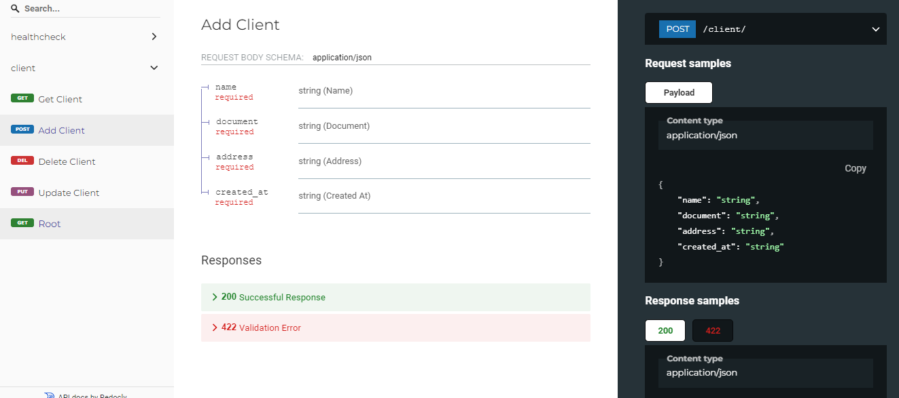

# fast-api-microservice
Microserviço em FastApi - Python

Criação de um microserviço: 

- Microserviço já containerizado para uso em orquestradores (uso de dockerfile). 
- A aplicação utiliza a extensão .devcontainer do VSCode para facilitar o ambiente de desenvolvimento. 
- A aplicação possui as configurações de devcontainer para uso em ambiente de desenvolvmento (devcontainer.json; docker-compose.yml e Dockerfile)
- Para rodar a aplicação:
    - Instalar e rodar o Docker
    - Ter o VSCode com a extensão "Dev Containers" para executar a estrutura do docker-compose em ambiente de desenvolvimento
    - Rodar o dev container
    - Executar o "RUN AND DEBUG" para subir a aplicação
- Aplicação utiliza a linguagem python e o framework FastAPI. O FastAPI foi escolhido por apresentar simplicidade e robustez.
- O microserviço conta com um CRUD de usuários, healthcheck, teste unitários e documentação
- A documentação segue o padrão swagger e a especificação OPENAPI.
- A aplicação conta com o uso da lib "Task" do python para automatizar algumas tarefas, como a execução de teste e coverage.

Estrutura do microserviço


Documentação
- http://127.0.0.1:8000/docs -> SwaggerUI
- http://127.0.0.1:8000/redoc -> openapi specification 

SwaggerUI


OpenAPI


DDL da criação da table no banco de dados:

```SQL
CREATE TABLE client_db.client (
	id INTEGER auto_increment NOT NULL,
	name varchar(100) NULL,
	document varchar(100) NULL,
	address varchar(100) NULL,
	created_at TIMESTAMP NULL,
	deleted_at TIMESTAMP NULL
)
ENGINE=InnoDB
DEFAULT CHARSET=utf8mb4
COLLATE=utf8mb4_0900_ai_ci;
```

List de próximos passos:

Melhorar documentação
1. explicar estrutura - DONE
2. explicar como colocar aplicação "em pé" - DONE
3. explicar swagger e openapi specification - DONE
4. explicar uso do "task" e do uso do pytest/coverage - DONE

Criação de conexão com BD para CRUD 
1. add client - DONE
2. get clients - DONE
3. remove client - DONE
4. arquivo de config e uso do .env - DONE
5. conexão com banco de dados - DONE
6. criação automática das tables no BD

Criação de testes unitários
1. testar main - DONE
2. testar healthcheck - DONE
3. testar outros endpoints

Adicionar servidor web
1. conectar com nginx

Adicionar camada de observabilidade
1. Integrar com o Sentry.io